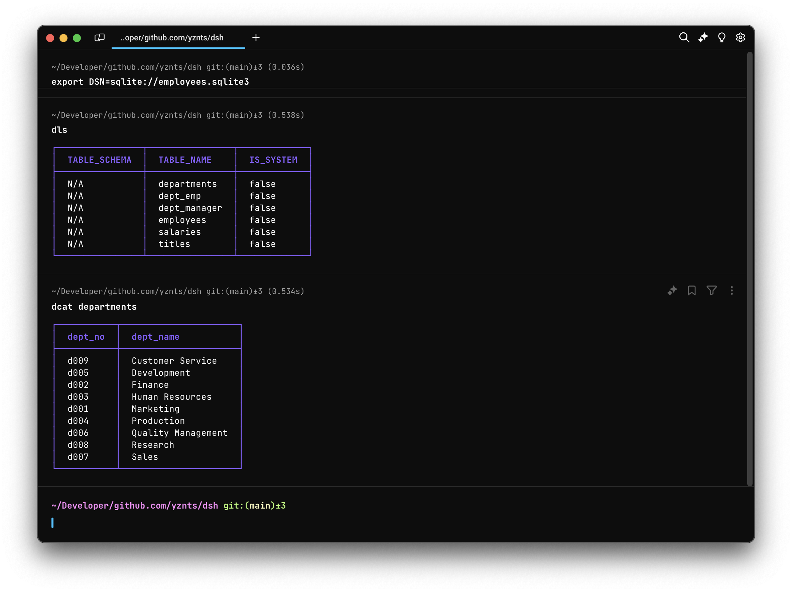

<h1 align="center">dsh</h1>

<p align="center">
  Set of database tools
</p>

```go
go install github.com/yznts/dsh/cmd/...
```

Main purpose of this project is to provide set of utilities for working with databases.

Let's start straight from what it proposes:
- Multi-platform support
- Multi-database support (when it's possible)
- Multiple output formats (JSON, JSONL, CSV, etc.)
- UNIX-like approach (one tool, one purpose)



You will have tools like:
- `dls`   - lists database tables or table columns
- `dsql`  - executes SQL queries
- `dcat`  - outputs table data (in the not-so-dumb way)

With multiple output formats,
e.g. json, jsonl (json lines), csv,
or pretty-formatted terminal output.

## Installation

Now, you can install/use this tooling with this options:
- Install in Go-way
- Build by yourself
- Spin-up a Docker container

### Install in Go-way

This is the easiest way to install,
but you need to have Go installed on your machine,
including `GOBIN` in your `PATH`.

```bash
go install github.com/yznts/dsh/cmd/...
```

### Build by yourself

This way still requires Go to be installed on your machine,
but it's up to you to decide where to put the binaries.

```bash
mkdir -p /tmp/dsh && cd /tmp/dsh
git clone git@github.com:yznts/dsh.git .
make build

# You'll find binaries in the `bin` directory.
# Feel free to move them to the desired location, e.g. /usr/local/bin.
```

### Spin-up a Docker container

Docker way doesn't require Go to be installed on your machine
and it allows you to use the tooling in isolated way,
without polluting your system.

```bash
docker run --rm -it ghcr.io/yznts/dsh:latest
```
